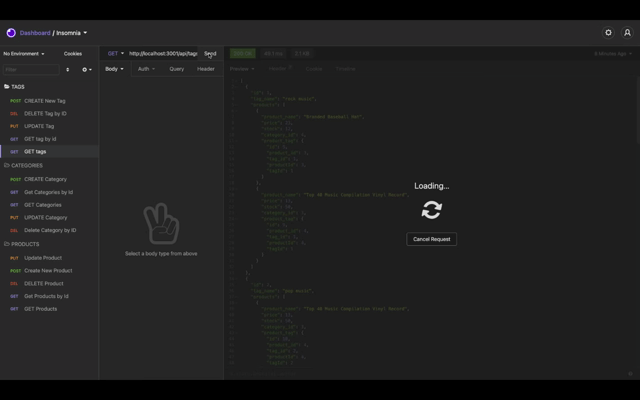

# Object-Relational Mapping (ORM): E-Commerce Back End


## Description

This application was created as a back end e-commerce website.

```md
GIVEN a functional Express.js API
WHEN I add my database name, MySQL username, and MySQL password to an environment variable file
THEN I am able to connect to a database using Sequelize
WHEN I enter schema and seed commands
THEN a development database is created and is seeded with test data
WHEN I enter the command to invoke the application
THEN my server is started and the Sequelize models are synced to the MySQL database
WHEN I open API GET routes in Insomnia Core for categories, products, or tags
THEN the data for each of these routes is displayed in a formatted JSON
WHEN I test API POST, PUT, and DELETE routes in Insomnia Core
THEN I am able to successfully create, update, and delete data in my database
```

The following technologies were used to create this application

- MySQL
- MySQL2
- Sequelize
- Insomnia Core
- Dotenv

## Table of Contents

- [Installation](#installation)
- [Usage](#usage)
- [Video Demonstration](#videoDemo)
- [Resources](#resources)
- [Questions](#questions)

## Installation

To install the application clone the repository from GitHub. Invoke the command `npm install` in your terminal.

## Video Demonstration

To view a walk-through of how to use the generator please refer to the [video demonstration](https://youtu.be/_IxX3fwniyM)

The following animation shows the API POST, PUT, DELETE and GET routes to return all categories, return a single category, all products, a single product all tags and a single tag being tested in Insomnia Core:



The following animation shows the application's POST, PUT, and DELETE routes for categories being tested in Insomnia Core:


### Resources

- [MySQL2](https://www.npmjs.com/package/mysql2)
- [Sequelize](https://www.npmjs.com/package/sequelize)
- [dotenv](https://www.npmjs.com/package/dotenv)

## Questions

If you have any questions or would like to report and issue please contact me at my [GitHub](https://github.com/harmane4) or elise_harman@hotmail.com
